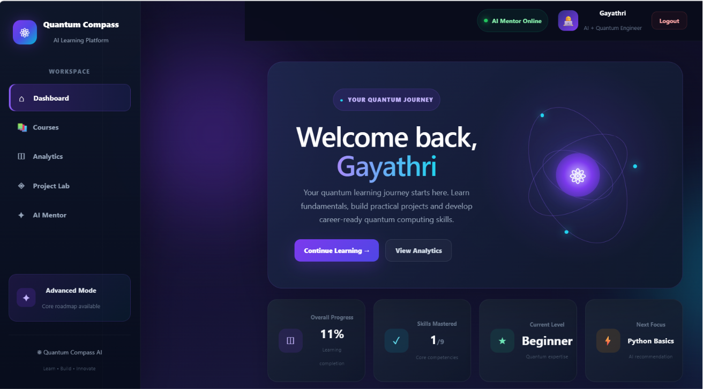
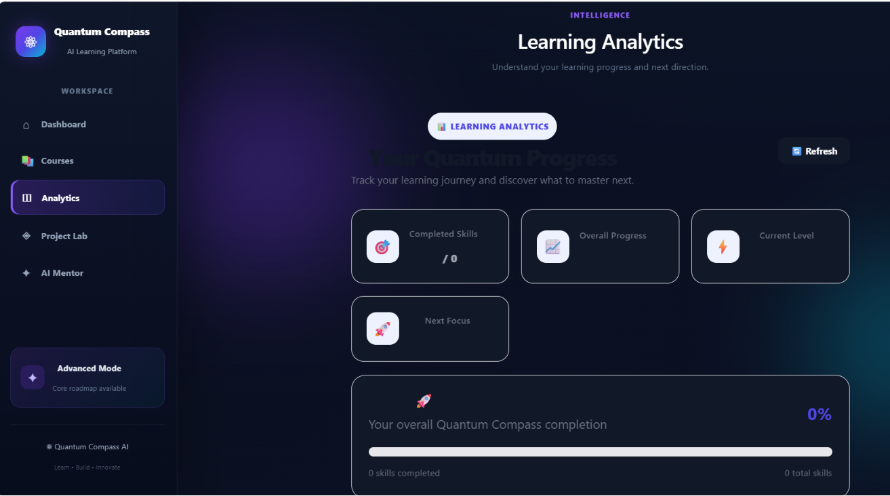
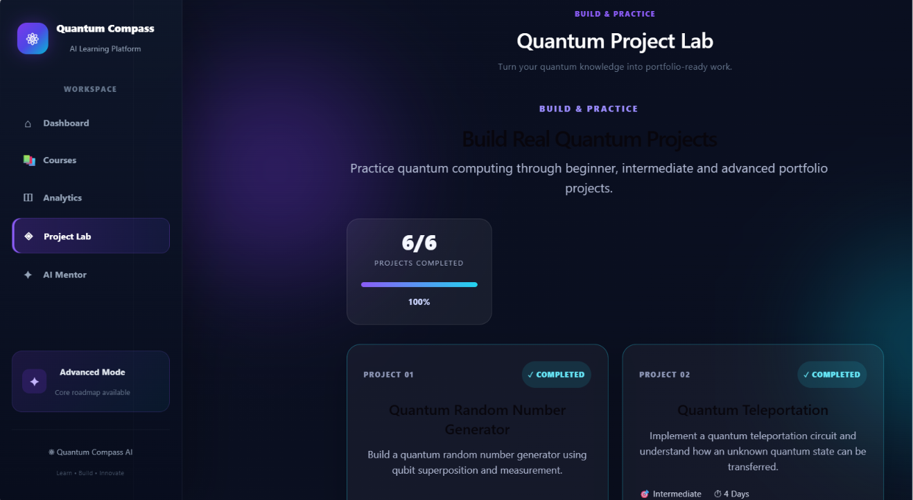
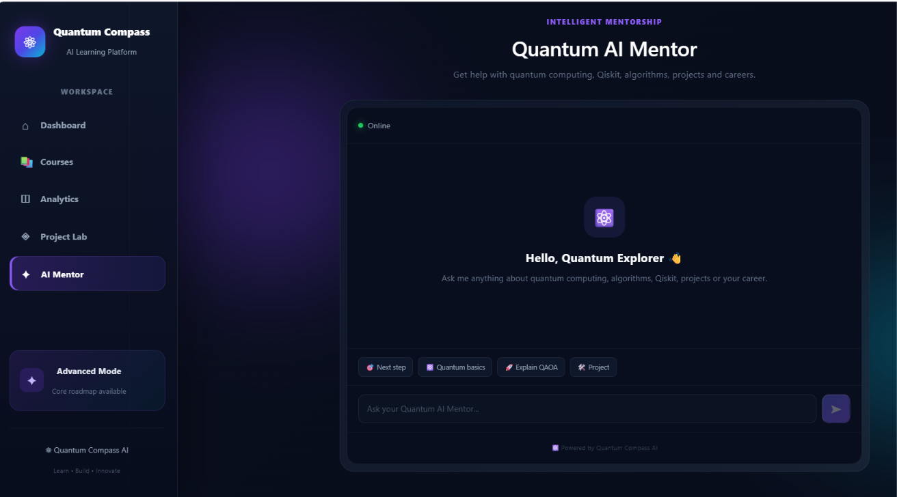

# ⚛️ Quantum Compass

### AI-Powered Quantum Computing Learning Platform

Quantum Compass is an AI-powered educational platform designed to help learners build practical skills in **quantum computing** through personalized learning roadmaps, skill analysis, project recommendations, progress tracking, analytics, and an AI-powered mentor.
---

## 🎥 Recorded Project Demo

A complete 4-minute walkthrough of the Quantum Compass platform is available below.

**🎬 [View Quantum Compass Demo Recording](./demo/quantum-compass-demo.mp4)**

The demonstration covers:

* User login and authentication
* Personalized learning dashboard
* Learning roadmap
* Practical quantum projects
* Progress analytics
* AI Quantum Mentor
* Technology architecture and project vision

> The demo recording is stored in the repository using Git LFS.

---

## 🎯 Problem Statement

Learning quantum computing can be difficult for beginners because the required mathematics, programming, quantum concepts, algorithms, and practical projects are often spread across different resources.

**Quantum Compass brings these learning components together into one structured learning environment.**

The platform is designed to help learners:

* Understand their current skill level
* Follow a structured learning roadmap
* Learn quantum computing concepts progressively
* Practice through hands-on projects
* Track learning progress
* Analyze skills
* Receive project recommendations
* Interact with an AI-powered mentor

---

## ✨ Key Features

### 🎯 Personalized Learning Roadmap

Quantum Compass provides a structured learning path covering areas such as:

* Python Programming
* Linear Algebra
* Quantum Computing Fundamentals
* Qubits
* Quantum Gates
* Qiskit
* Quantum Algorithms
* Quantum Optimization
* Quantum Machine Learning
* Practical Quantum Projects

### 📊 Learning Dashboard

The dashboard provides learners with an overview of:

* Current learning level
* Overall progress
* Completed skills
* Recommended next skills
* Learning roadmap
* Career goal

### 📈 Analytics

The analytics section helps learners monitor:

* Overall learning progress
* Completed skills
* Total skills
* Current learning level
* Project completion

### 🧠 Skill Analysis

The platform analyzes learner information and provides skill-level insights to help identify suitable learning areas and next steps.

### 🎯 Project Recommendations

Quantum Compass recommends practical projects based on the learner's level and learning progress.

### 🛠️ Quantum Project Lab

The project system is designed around progressive hands-on learning.

| Project                             | Level        | Main Concepts                                           |
| ----------------------------------- | ------------ | ------------------------------------------------------- |
| Quantum Random Number Generator     | Beginner     | Qubits, Superposition, Measurement, Qiskit              |
| Quantum Teleportation               | Intermediate | Entanglement, CNOT, Hadamard Gates                      |
| Grover Search Algorithm             | Advanced     | Oracle, Amplitude Amplification, Quantum Search         |
| QAOA Optimization                   | Advanced     | QAOA, Parameterized Circuits, Optimization              |
| Quantum Machine Learning Classifier | Advanced     | Feature Encoding, Variational Circuits, Hybrid Learning |
| Quantum Compass Capstone            | Advanced     | Quantum Education, AI Guidance, Projects, Analytics     |

### 🤖 AI Quantum Mentor

The AI Mentor provides learning guidance around:

* Quantum computing
* Qiskit
* Quantum algorithms
* Quantum projects
* Learning paths
* Career-oriented guidance

---

## 📸 Screenshots

### Dashboard

### Analytics

### Projects

### AI Mentor

---

## 🏗️ System Architecture

                    ┌─────────────────────────┐
                    │     React Frontend      │
                    │       Vite + JS         │
                    └────────────┬────────────┘
                                 │
                                 │ REST API
                                 ▼
                    ┌─────────────────────────┐
                    │     Flask Backend       │
                    │       API Layer         │
                    └────────────┬────────────┘
                                 │
              ┌──────────────────┼──────────────────┐
              │                  │                  │
              ▼                  ▼                  ▼
      ┌──────────────┐   ┌──────────────┐   ┌────────────────┐
      │ SQLite DB    │   │ Skill / ML   │   │ Project        │
      │              │   │ Analysis     │   │ Recommendation │
      └──────────────┘   └──────────────┘   └────────────────┘
              │                  │                  │
              └──────────────────┼──────────────────┘
                                 ▼
                    ┌─────────────────────────┐
                    │ Quantum Learning System │
                    └─────────────────────────┘

---

## 🛠️ Technology Stack

### Frontend

* React
* JavaScript
* CSS
* Vite

### Backend

* Python
* Flask
* Flask-CORS

### Database

* SQLite

### Data & Intelligence

* Python-based skill analysis
* Progress tracking
* Personalized roadmap logic
* Project recommendation system
* Learner data stored in CSV datasets

### Quantum Computing Concepts

* Qubits
* Superposition
* Measurement
* Entanglement
* Quantum Gates
* Grover's Algorithm
* QAOA
* Quantum Machine Learning
* Qiskit

---

## 📁 Project Structure

quantum-compass/
│
├── backend/
│   ├── app.py
│   ├── auth.py
│   ├── database.py
│   ├── model.py
│   ├── progress_model.py
│   ├── project_model.py
│   ├── project_recommender.py
│   ├── skill_analyzer.py
│   ├── progress_data.csv
│   ├── project_data.csv
│   ├── skill_data.csv
│   ├── student_data.csv
│   ├── requirements.txt
│   ├── test_api.py
│   └── test_ml.py
│
├── frontend/
│   ├── public/
│   ├── src/
│   │   ├── Analytics.jsx
│   │   ├── App.jsx
│   │   ├── Chat.jsx
│   │   ├── ChatBot.jsx
│   │   ├── Courses.jsx
│   │   ├── Login.jsx
│   │   ├── Projects.jsx
│   │   ├── ProjectWorkspace.jsx
│   │   ├── SkillAnalyzer.jsx
│   │   └── ...
│   ├── package.json
│   └── package-lock.json
│
├── screenshots/
│   ├── ai-mentor.png
│   ├── analytics.png
│   ├── dashboard.png
│   └── projects.png
│
├── .gitignore
└── README.md

> The local SQLite database and development-only files are excluded from version control through `.gitignore`.

---

## ⚙️ Installation & Setup

### 1. Clone the Repository

git clone https://github.com/lakshmigayathri1944/quantum-compass.git
cd quantum-compass

### 2. Set Up the Backend

Open a terminal:

cd backend
py -m pip install -r requirements.txt
py app.py

The Flask backend should run at:

http://127.0.0.1:5000

### 3. Set Up the Frontend

Open a **second terminal**:

cd frontend
npm install
npm run dev

Open the local URL displayed by Vite in your browser.

---

## 🔌 Backend API

The backend exposes API endpoints for authentication, dashboards, analytics, progress, projects, recommendations, skill analysis, and the AI mentor.

| Endpoint                                    | Method | Purpose                  |
| ------------------------------------------- | ------ | ------------------------ |
| `/login`                                    | POST   | User authentication      |
| `/dashboard/<user_id>`                      | GET    | Dashboard data           |
| `/analytics/<user_id>`                      | GET    | Learning analytics       |
| `/progress`                                 | POST   | Update learning progress |
| `/recommend/<user_id>`                      | GET    | Project recommendations  |
| `/projects/<user_id>`                       | GET    | Project information      |
| `/projects/<user_id>/<project_id>/start`    | POST   | Start a project          |
| `/projects/<user_id>/<project_id>/complete` | POST   | Complete a project       |
| `/skill-analysis/<user_id>`                 | GET    | Skill analysis           |
| `/chat`                                     | POST   | AI Mentor interaction    |
| `/health`                                   | GET    | Backend health check     |

---

## 🧪 Backend Health Check

The backend provides a health-check endpoint:

GET /health

Example:

{
  "database": "Connected",
  "service": "Quantum Compass AI Backend",
  "status": "healthy"
}

---

## 🧭 Learning Journey

Quantum Compass follows a progressive learning model:

Python
   ↓
Linear Algebra
   ↓
Quantum Fundamentals
   ↓
Qubits
   ↓
Quantum Gates
   ↓
Qiskit
   ↓
Quantum Algorithms
   ↓
Quantum Optimization
   ↓
Quantum Machine Learning
   ↓
Practical Quantum Projects

This progression helps learners move from fundamental concepts toward practical quantum computing applications.

---

## 🧪 Testing

Backend testing files are included in the project:

backend/test_api.py
backend/test_ml.py

These can be used to validate API functionality and model-related functionality during development.

---

## 🔮 Future Improvements

Potential future enhancements include:

* Integration with real quantum hardware
* IBM Quantum backend integration
* Interactive quantum circuit visualization
* More advanced AI tutoring
* Automated coding/project evaluation
* Additional quantum algorithms
* Student leaderboards
* Certification and achievement system
* Cloud deployment
* Advanced career recommendations

---

## 🎯 Project Vision

Quantum Compass aims to make quantum computing education:

**Accessible → Structured → Practical → Personalized → Career-oriented**

The long-term goal is to provide learners with a single platform where they can **learn concepts, analyze their skills, practice projects, track progress, and receive guidance** throughout their quantum computing journey.

---

## 👩‍💻 Author

**Kolli Lakshmi Gayathri**

Computer Science Engineering

---

## 📌 Project Status

**Quantum Compass — Capstone Project**

* React + Vite frontend
* Flask backend
* SQLite database
* Skill analysis
* Progress tracking
* Project recommendation
* AI Mentor
* Analytics dashboard
* Practical quantum project learning
---

## 🎬 Demo & Presentation

**Recorded Prototype Walkthrough:**
[Quantum Compass — 4-Minute Demo](./demo/quantum-compass-demo.mp4)

The recorded demonstration presents the working prototype, including the dashboard, learning roadmap, project system, analytics, and AI mentor.

---

---

## 📄 License

This project is currently intended as an educational and portfolio project.